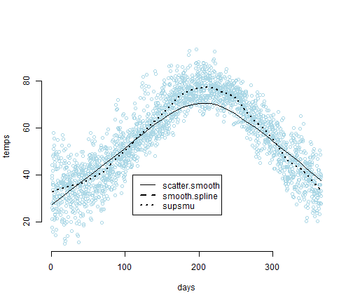

An R Markdown Example
========================================================

This is an R Markdown document. Markdown is a simple formatting syntax for authoring web pages.

knitr allows us to embed R code within Markdown documents. This combination of Markdown/R is then translated into html for display in web pages.

The following code chunk loads the package UsingR which contains the dataset for our example:

```r
library("UsingR")
```


And now we'll generate a plot illustrating three different smoothing techniques using the code below:

```r
attach(five.yr.temperature)
scatter.smooth(temps ~ days, col = "light blue", bty = "n")
lines(supsmu(days, temps), lty = 3, lwd = 2)
legend(x = 110, y = 40, lty = c(1, 2, 3), lwd = c(1, 2, 2), legend = c("scatter.smooth", 
    "smooth.spline", "supsmu"))
```

 

```r
detach(five.yr.temperature)
```


